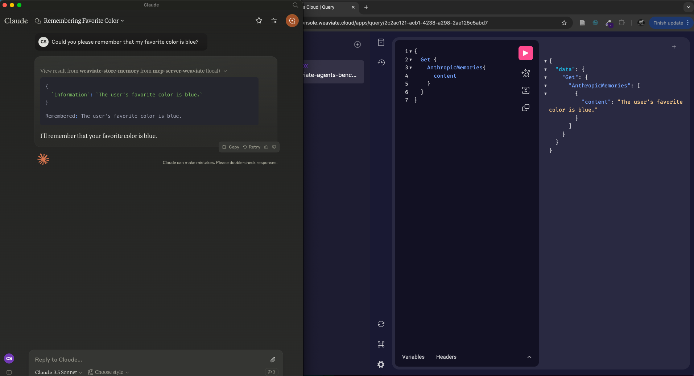

# mcp-server-weaviate
[](https://smithery.ai/server/@weaviate/mcp-server-weaviate)

MCP server for Weaviate

## 🏎️ Quickstart

### Prerequisites

- Ensure you have `uv` installed (see
  [the docs](https://docs.astral.sh/uv/getting-started/installation/) for
  details)
- Clone this repository

### Install

#### Installing via Smithery

To install Weaviate MCP Server for Claude Desktop automatically via [Smithery](https://smithery.ai/server/@weaviate/mcp-server-weaviate):

```bash
npx -y @smithery/cli install @weaviate/mcp-server-weaviate --client claude
```

#### Claude Desktop

On MacOS: `~/Library/Application\ Support/Claude/claude_desktop_config.json`

On Windows: `%APPDATA%/Claude/claude_desktop_config.json`

Development/Unpublished Servers Configuration

```
{
  "mcpServers": {
    "mcp-server-weaviate": {
      "command": "PYTHON_PATH",
      "args": [
        "-m",
        "src.server",
        "--weaviate-url",
        "YOUR_WEAVIATE_URL",
        "--weaviate-api-key",
        "YOUR_WEAVIATE_API_KEY",
        "--search-collection-name",
        "YOUR_SEARCH_COLLECTION",
        "--store-collection-name",
        "YOUR_STORE_COLLECTION",
        "--openai-api-key",
        "YOUR_OPENAI_API_KEY"
      ],
      "env": {
        "PYTHONPATH": "PATH_TO_MCP_SERVER_WEAVIATE_DIRECTORY"
      }
    }
  }
}
```


